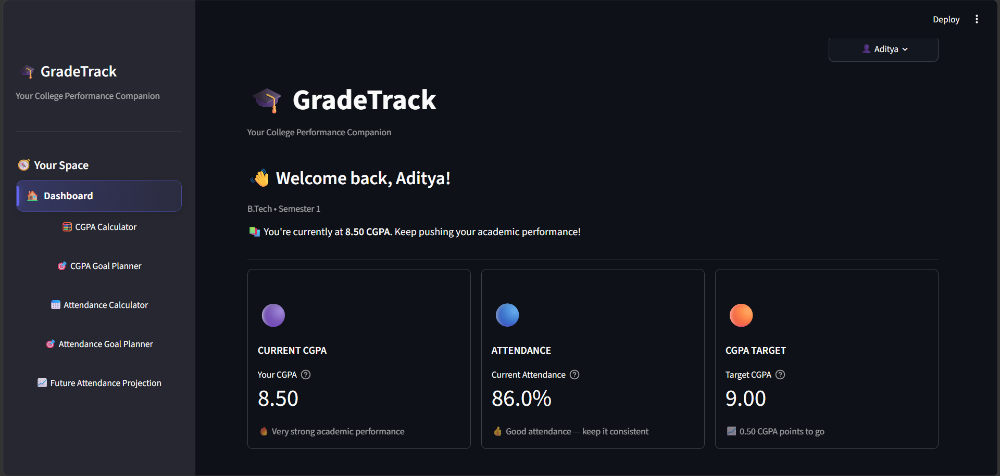
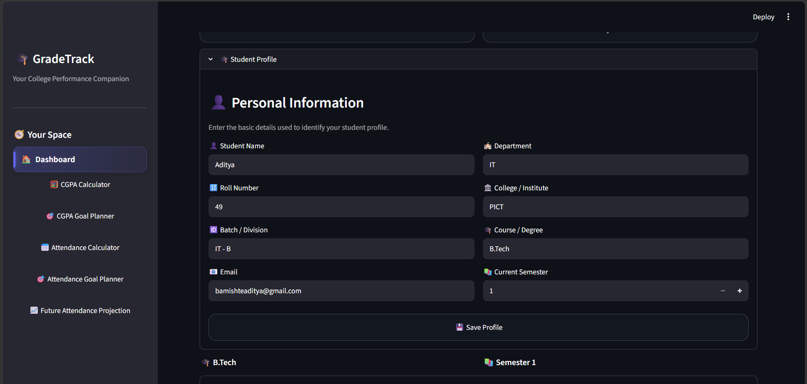
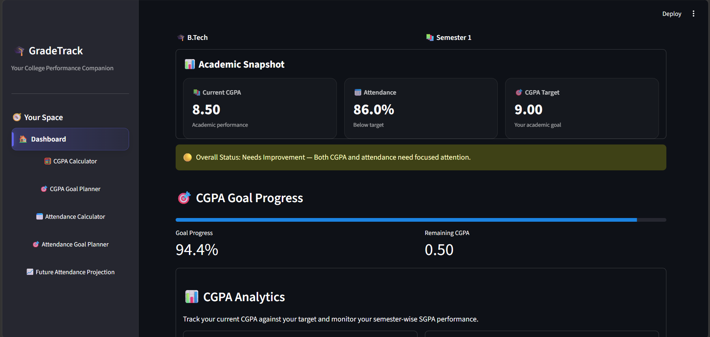
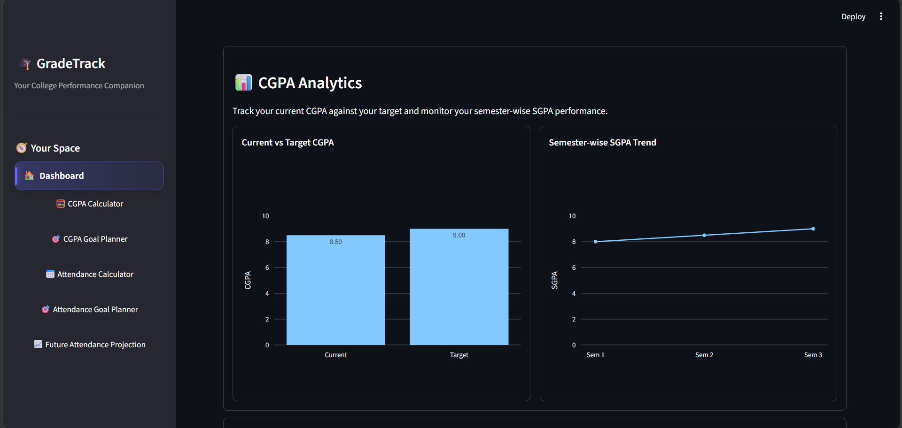
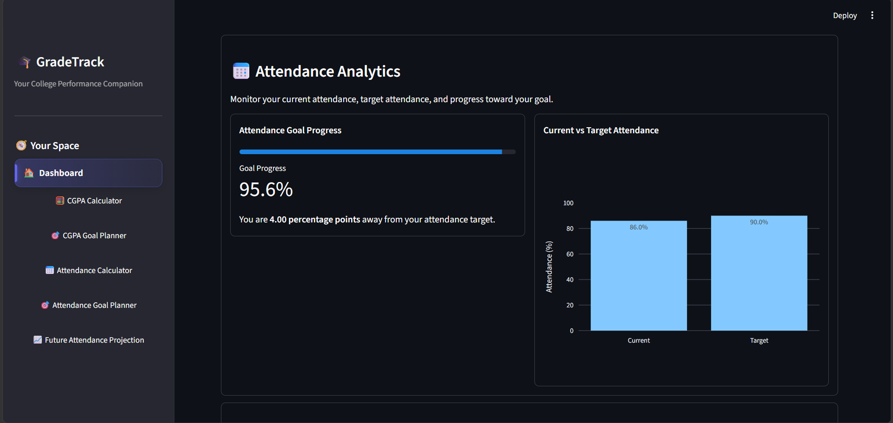
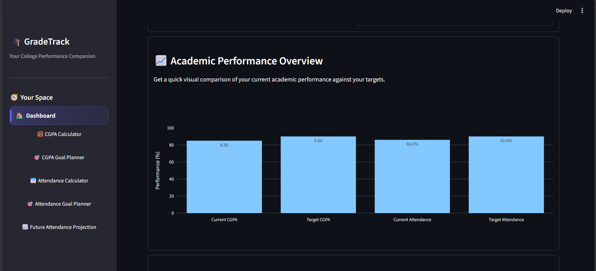
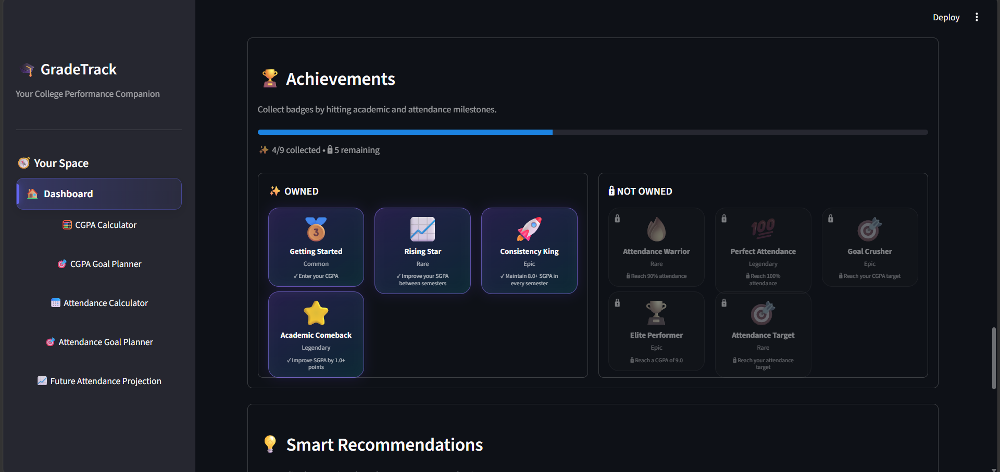
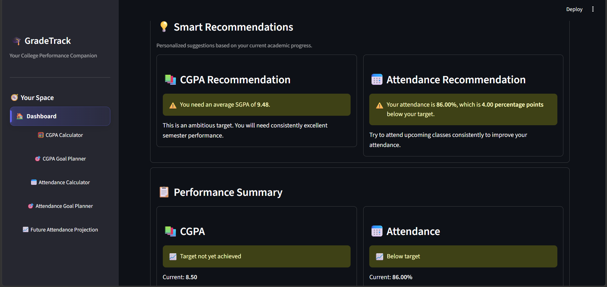

# 🎓 GradeTrack

### College Performance Tracker & Goal Planner

GradeTrack is a student-focused Streamlit application that helps college students track their academic performance, calculate CGPA and attendance, set academic goals, and plan their progress throughout college.

---

## ✨ Features

### 📊 Dashboard

* View your current CGPA and attendance at a glance
* See your academic profile
* Track progress toward your goals
* Get smart recommendations based on your performance
* Earn achievement badges

### 🧮 CGPA Calculator

* Calculate semester-wise SGPA
* Calculate overall CGPA
* Enter multiple subjects and credits
* Track academic performance across semesters

### 🎯 CGPA Goal Planner

* Set a target CGPA
* Calculate the SGPA required in remaining semesters
* Check whether your target is achievable
* Understand how your future performance affects your final CGPA

### 📅 Attendance Calculator

* Calculate current attendance
* Determine how many classes are required to reach a target attendance
* Plan attendance recovery

### 🎯 Attendance Goal Planner

* Set an attendance target
* Calculate the classes needed to reach your goal
* Get actionable attendance guidance

### 📈 Future Attendance Projection

* Project future attendance based on upcoming classes
* Understand how attending or missing classes affects your percentage

### 👤 Multiple Student Profiles

* Create multiple student profiles
* Store personal and academic information separately
* Switch between students
* Automatically save academic data

### 🏆 Achievement Badges

* Unlock badges based on academic and attendance milestones
* Track your progress in a more engaging way

---

## 🛠️ Tech Stack

* **Python**
* **Streamlit**
* **Plotly**
* **SQLite**
* **Git & GitHub**

---

## 📁 Project Structure

```text
GradeTrack/
│
├── app.py
├── database.py
├── requirements.txt
├── README.md
├── .gitignore
│
└── calculations/
    ├── achievements.py
    ├── attendance.py
    └── cgpa.py
```

> `gradetrack.db`, `venv/`, and Python cache files are excluded from Git using `.gitignore`.

---

## 🚀 Getting Started

### 1. Clone the repository

```bash
git clone <your-repository-url>
cd GradeTrack
```

### 2. Create a virtual environment

```bash
python -m venv venv
```

### 3. Activate the virtual environment

#### Windows

```powershell
venv\Scripts\activate
```

#### macOS / Linux

```bash
source venv/bin/activate
```

### 4. Install dependencies

```bash
pip install -r requirements.txt
```

### 5. Run GradeTrack

```bash
streamlit run app.py
```

The application will open in your browser.

---

## 🔐 Data & Privacy

GradeTrack uses a local SQLite database to store student information.

The database file is intentionally excluded from GitHub through `.gitignore` so personal student data is not uploaded to the repository.

---

## 🎯 Project Goals

GradeTrack was designed to make academic tracking more useful and engaging for college students.

Instead of simply displaying calculations, the application focuses on:

* Understanding current academic performance
* Setting realistic goals
* Planning future performance
* Monitoring attendance
* Making academic data easier to understand

---

## 🔮 Future Improvements

Potential future improvements include:

* Cloud-based student accounts
* Authentication
* Data visualization dashboards
* Semester performance history
* Exportable academic reports
* Mobile-friendly improvements
* Cloud database support
* More achievement badges and student insights

---

## 📸 Screenshots

### 🏠 Dashboard



### 📊 Dashboard Insights & Achievements















### 🧮 CGPA Calculator


### 🎯 CGPA Goal Planner


### 📅 Attendance Calculator


### 🎯 Attendance Goal Planner


### 📈 Future Attendance Projection


---

## 👨‍💻 Author

**Aditya**

Built as a college project to explore Python, Streamlit, databases, UI design, and practical software development.
